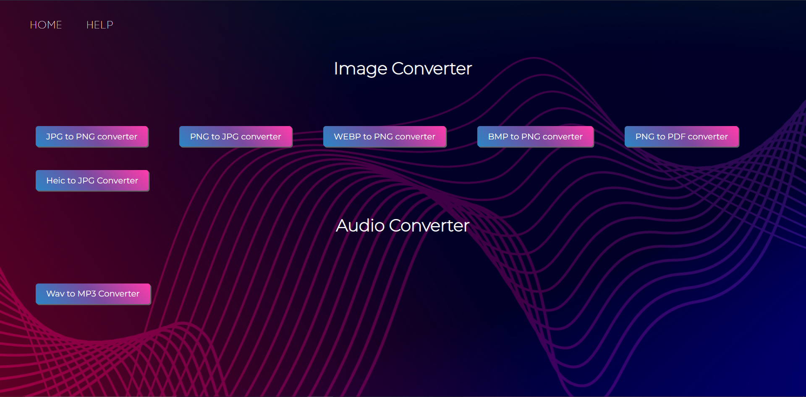

# 🔄 Morphify – Your Smart File Conversion Companion

**Morphify** is a lightweight, user-friendly web application built with Flask that helps you convert files effortlessly. Whether you're converting documents, images, or other file types, Morphify handles it for you — quickly, securely, and with a clean interface.

---

## 🚀 Features

- ⚡ Simple and intuitive file upload interface  
- 🔁 Fast file conversion process via server-side logic  
- 💾 Instant download after conversion  
- 📱 Responsive design for mobile and desktop  
- 🛠️ Help & Troubleshooting guide

---

## 📸 Preview

> 

---

## 🧪 Tech Stack

- Python 3  
- Flask  
- HTML / CSS / JavaScript  
- Bootstrap (optional if used)

---

## 🖥️ Getting Started

### 🔧 Prerequisites

Make sure you have the following installed:

- Python 3.8+
- pip (Python package installer)

---

### 📦 Installation & Running Locally

1. **Clone the repository:**
```bash
git clone https://github.com/your-username/morphify.git
cd morphify
```
2. **Run the app**
```bash
   python app.py
```
3. Open browser and navigate to
   http://127.0.0.1:5000/

🧭 How to Use Morphify
1. Navigate to the homepage.
2. Choose the file type and the desired conversion tool.
3. Upload your file from your device.
4. Click the Convert button.
5. Download your freshly converted file.

🛟 Troubleshooting & Help
If you encounter any issues:
1. Check the terminal/console for error logs.
2. Make sure file formats are supported.
Still stuck? Feel free to contact me.

💡 Future Improvements
1. Add support for more file formats
2. Implement progress indicators
3. Enhance UI with animations and alerts
4. User authentication for saving conversion history

🤝 Contributing

Contributions are welcome!
Feel free to open issues or submit a pull request.

📄 License

This project is open-source.

✨ Author

Prathamesh Gongle

📧 prathameshgongle@gmail.com

🔗 [LinkedIn](https://www.linkedin.com/in/prathamesh-gongle)


